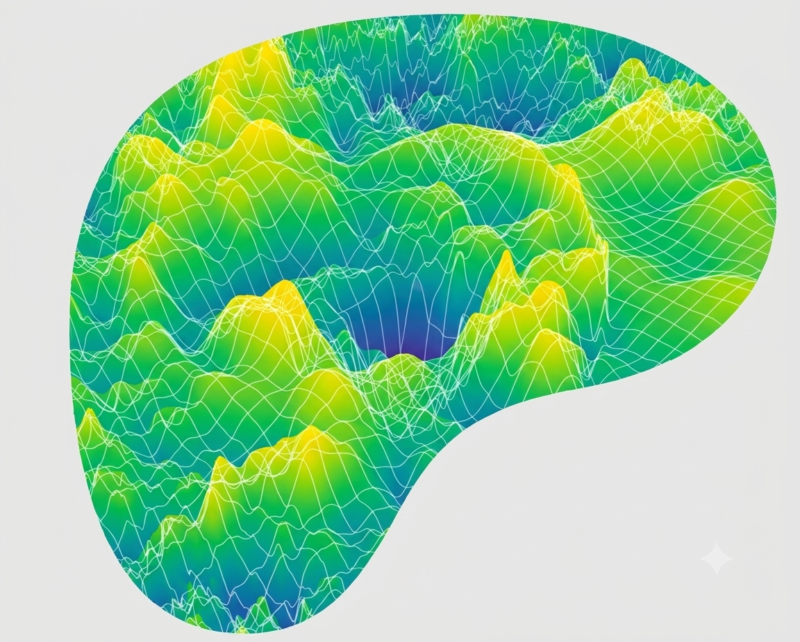
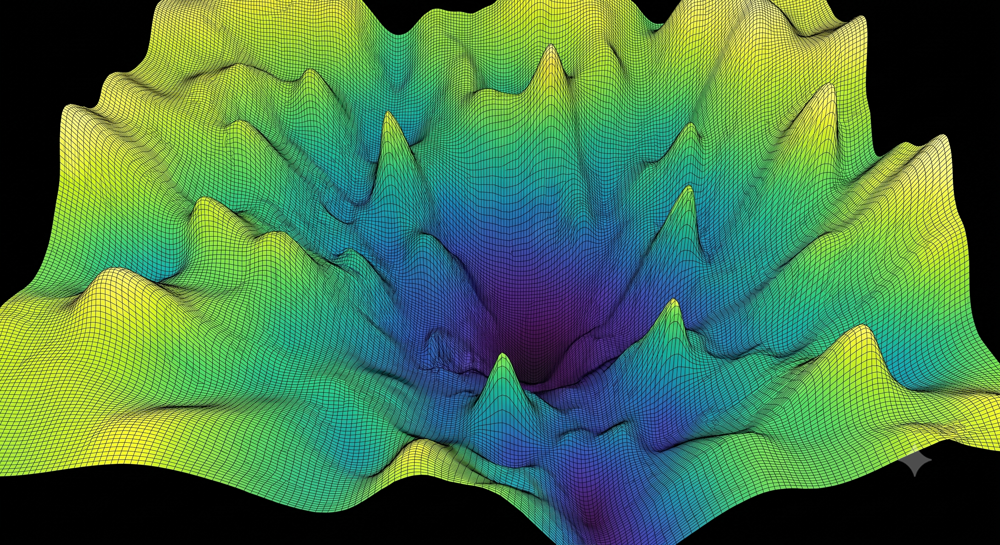
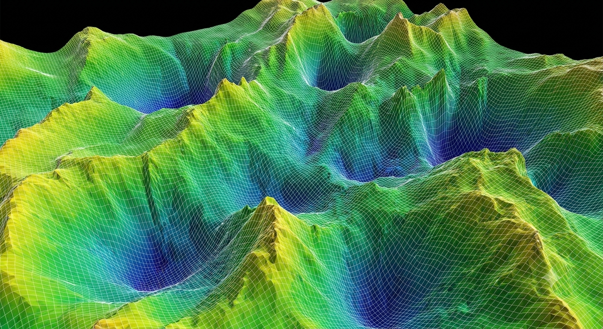

# Portfolio
## Tech Stack
- **React 19 + Vite** with Bun and TypeScript strict mode
- **React Router v7**
- **Tailwind CSS v4**
- **Shadcn/ui** for primitives
- **MagicUI** for animated components
- **Framer Motion** for page transitions and scroll reveals
- **i18next + react-i18next** (the RTL support for Arabic is via `dir="rtl"` on `<html>`)
- **Cloudflare Pages** or **Vercel** or **Netlify**
- Shadertoy iframe embed
- (Optional) WebGL (for shaders)
- (Optional) React Three Fiber + Drei

---

## Projets
- [ ] Shaders
- [ ] Hackathon ?
- [ ] Visualisation APP5
- [ ] VibeHealth
- [ ] Escampe
- [ ] Watchlist Service
- [ ] Compilateur
- [ ] MagnusCarlos
- [ ] XTTS finetuning
- [ ] Quizine
- [ ] ThreeJS project
- [ ] Reaction Planner + SciNB ?
- [ ] IGSD pyramide momie
- [ ] IPO - jeux
- [ ] APP4 Méthodes Numériques - SVD
- [ ] TP noté Recherche Opérationnelle
- [ ] Rapport Cybersec + labs
- [ ] TP3 Apprentissage automatisé

---

## Tools
### Color Palettes
- [OKLCH](https://oklch.fyi/color-palettes)
- [UI Colors](https://uicolors.app/generate/0c17f6) - color tester
- [Real-Time Colors](https://www.realtimecolors.com/?colors=050315-fbfbfe-2f27ce-dedcff-433bff&fonts=Inter-Inter) - color tester
- [Palette UI](https://www.paletteui.xyz/) - prebuilt color palettes

### Assets Generator
- [FFFuel](https://www.fffuel.co/) - extensive SVG generator
- [Space Type Generator](https://spacetypegenerator.com/) - rotating text generator
- [Shader Background gradient](https://shadergradient.co/customize?animate=on&axesHelper=off&brightness=1.2&cAzimuthAngle=180&cDistance=3.6&cPolarAngle=90&cameraZoom=1&color1=%23ff5005&color2=%23dbba95&color3=%23d0bce1&destination=onCanvas&embedMode=off&envPreset=city&format=gif&fov=45&frameRate=10&gizmoHelper=hide&grain=on&lightType=3d&pixelDensity=1&positionX=-1.4&positionY=0&positionZ=0&range=disabled&rangeEnd=40&rangeStart=0&reflection=0.1&rotationX=0&rotationY=10&rotationZ=50&shader=defaults&type=plane&uAmplitude=1&uDensity=1.3&uFrequency=5.5&uSpeed=0.4&uStrength=4&uTime=0&wireframe=false)

### Tools
- [SVG Studio](https://www.svgstudio.org/) - svg animation studio
- [Tooools](https://www.tooooools.app/) - weird images effects
- [Design Engineer](https://designengineer.tools/)

---

## Shadcn registries
- [Shadcn Charts](https://ui.shadcn.com/charts)
- [Shadcn Blocks](https://ui.shadcn.com/blocks)

### General
- [Skipper UI](https://skiper-ui.com/)
- [Cult UI](https://www.cult-ui.com/)
- [Chanhdai Components](https://chanhdai.com/components) - pixel perfect components
- [UseLayouts](https://uselayouts.com/) - micro interactions

### AI
- [Prompt Kit](https://www.prompt-kit.com/) - perfect AI components ❤️
- [Elements AI SDK](https://elements.ai-sdk.dev/) - Vercel's shadcn AI elements
- [WebLLM Blocks](https://www.webllm.org/blocks&group=ux) - WebLLM
- [Assistant UI](https://www.assistant-ui.com/)

### Mini components libraries
- [React Bits](https://reactbits.dev/)
- [Dot Matrix](https://dotmatrix.zzzzshawn.cloud/) ❤️
- [MapCN](https://www.mapcn.dev/) - general map components
- [Shadcn Maps](https://www.shadcnmaps.com/) - countries maps
- [Framer Icon Slide-In Button](https://www.framer.com/community/marketplace/components/icon-slide-in-button/) ❤️
- [Framer Animated Spiral](https://www.framer.com/community/marketplace/components/spiral/) ❤️

### Specific sections
- [TermCN](https://www.termcn.dev/)
- [Onboarding Tour](https://onboarding-tour.vercel.app/)
- [Policy Stack](https://www.policystack.dev/)
- [TOCN](https://tocn.vercel.app/)
- [Wigggle UI](https://wigggle-ui.vercel.app/widgets) - widgets
- [Loading UI](https://loading-ui.com/) ❤️
- [Nteract Elements](https://nteract-elements.vercel.app/docs) - interactive notebook components
- [Shadcn Editor](https://shadcn-editor.vercel.app/)
- [Heatmap](https://heatmap.chingru.com/) - heatmap for calendar, week, etc

### Animations
- [Lucide Animated](https://lucide-animated.com/) - animated icons ❤️
- [Animate UI](https://animate-ui.com/) - animated components (good one are the Preview Link Card, Avatar Group, Code Tabs)
- [Framer Motion Examples](https://motion.dev/examples?platform=react)

### Components
- [Design System](https://ds.asanshay.com/) - cool window, code block
- [Loading Carousel](https://www.cult-ui.com/docs/components/loading-carousel)
- [Canvas Fractal Grid](https://www.cult-ui.com/docs/components/canvas-fractal-grid) - interactive canvas
- [Terminal Animation](https://www.cult-ui.com/docs/components/terminal-animation) ❤️
- [Expandable](https://www.cult-ui.com/docs/components/expandable) - expandable card
- [Expandable Screen](https://www.cult-ui.com/docs/components/expandable-screen)
- [Evil Cooldown Buttons](https://www.evilbuttons.com/docs/cooldown-button)
- [Evil Frame Buttons](https://www.evilbuttons.com/docs/frame-button)
- [Evil Morph Status Buttons](https://www.evilbuttons.com/docs/morph-status-button)
- [Evil Troll Buttons](https://www.evilbuttons.com/docs/troll-button)
- [Evil 3D Buttons](https://www.evilbuttons.com/docs/3d-button)
- [Chanhdai Theme Switcher](https://chanhdai.com/components/theme-switcher) ❤️
- [Chanhdai Theme Toggle Effect](https://chanhdai.com/components/theme-toggle-effect) ❤️
- [Chanhdai TOC Minimap](https://chanhdai.com/components/toc-minimap) ❤️
- [Chanhdai Work Experience Component](https://chanhdai.com/components/work-experience-component) ❤️
- [Chanhdai Brand Assets Menu](https://chanhdai.com/components/brand-assets-menu)
- [Chanhdai Copy Button](https://chanhdai.com/components/copy-button)
- [Waves CN](https://waves-cn.vercel.app/) - waveforms
- [React Bits Card Nav](https://reactbits.dev/components/card-nav)

---

## Assets
- [Epoch Font](https://befonts.com/epoch-font.html) ❤️
- [Satoshi Font](https://www.fontshare.com/fonts/satoshi)
- [Geologica Font](https://fonts.google.com/specimen/Geologica) ❤️
- [Polymath Font Family](https://befonts.com/polymath-font-family.html)
- [Fira Code Font](https://fonts.google.com/specimen/Fira+Code)
- [Nunito Sans Font](https://fonts.google.com/specimen/Nunito+Sans)
- [Prints from Cosmos](https://www.cosmos.so/mat42/prints)
- 
-  ❤️
- 
- 
- 
-  ❤️
- [404 Design](https://www.404s.design/sites/a-color-bright) ❤️
- [Shieldcn](https://shieldcn.dev/) - badges
- [SVGL](https://svgl.app/) - svg of companies and brands ❤️
- [React Bits Strands](https://reactbits.dev/animations/strands) - Siri like strands animation ❤️
- [React Bits Beams](https://reactbits.dev/backgrounds/beams)
- [React Bits Fluid Glass](https://reactbits.dev/components/fluid-glass) ❤️
- [React Bits Pixel Card](https://reactbits.dev/components/pixel-card) ❤️